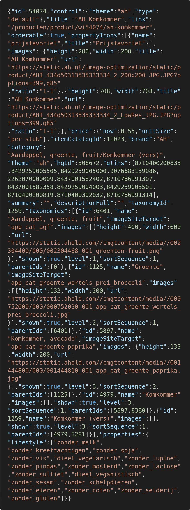

# ah.nl Product Scraper

> A bot that scrapes all available products from [ah.nl](https://www.ah.nl/producten)



The above screenshot is a sample of one product entry scraped by bot.

# Install

Make sure `node` and `npm` are insalled.

```bash
git clone https://github.com/skdcodes/freelancer-bot-ah.nl.git # clone repository
cd freelancer-bot-ah.nl
npm install # install node modules
```

# Usage

Run the command to start scraping:

```bash
npm start
# 2020-05-17 23:30:15 [index.js] info: Scraping category: "aardappel-groente-fruit"
# 2020-05-17 23:30:17 [index.js] info: Pages scraped: 1/3
# 2020-05-17 23:30:17 [index.js] info: Products found: 500
# .
# .
# .
```

# Features

One can enable various "pipelines" based on how they intend to store the data. Only the file pipeline is enabled by default. You can modify `index.js` to enable/disable pipelines at the following lines of :

```js
// index.js

const enabledPipelines = {
  file: true,
  images: false,
  SQL: false,
};
```

- The file pipeline store data locally to `dumps/data.jl`.
- The images pipeline downloads images concurrently to `dumps/images`.
- The SQL pipeline creates / inserts / updates products to a table `products` under a database `ah_nl`

# Notes

- The API enpoint imposes a max `pageSize` of `1000`.
- The API endpoint has not user-agent or bot checks.
- The main categories are enumerate explicity in `index.js` which are:

```js
// index.js

const categories = [
  "aardappel-groente-fruit",
  "verse-kant-en-klaar-maaltijden-salades",
  "vlees-kip-vis-vega",
  "kaas-vleeswaren-delicatessen",
  "zuivel-eieren",
  "bakkerij",
  "ontbijtgranen-broodbeleg-tussendoor",
  "frisdrank-sappen-koffie-thee",
  "wijn",
  "bier-sterke-drank-aperitieven",
  "pasta-rijst-internationale-keuken",
  "soepen-conserven-sauzen-smaakmakers",
  "snoep-koek-chips",
  "diepvries",
  "drogisterij-baby",
  "bewuste-voeding",
  "huishouden-huisdier",
  "koken-tafelen-non-food",
];
```

- You can create a local MS SQL Server 2017 instance for Ubuntu through [docker](https://hub.docker.com/_/microsoft-mssql-server) by running:

```bash
docker run -e 'ACCEPT_EULA=Y' -e 'SA_PASSWORD=yourStrong(!)Password' -p 1433:1433 -d mcr.microsoft.com/mssql/server:2017-CU8-ubuntu
```
